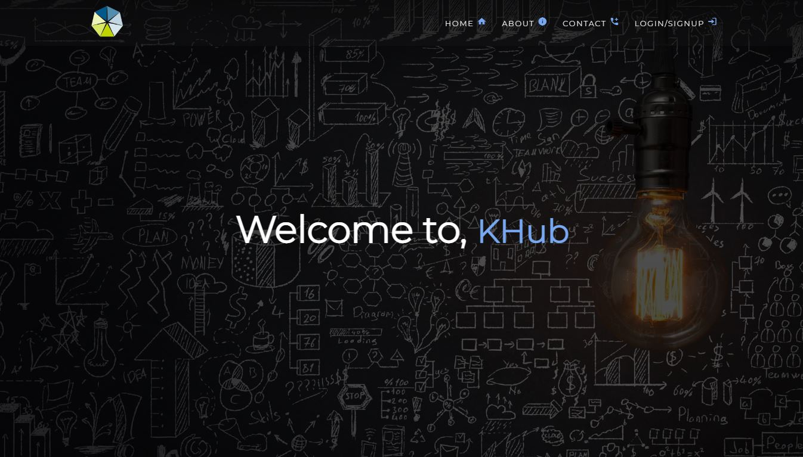
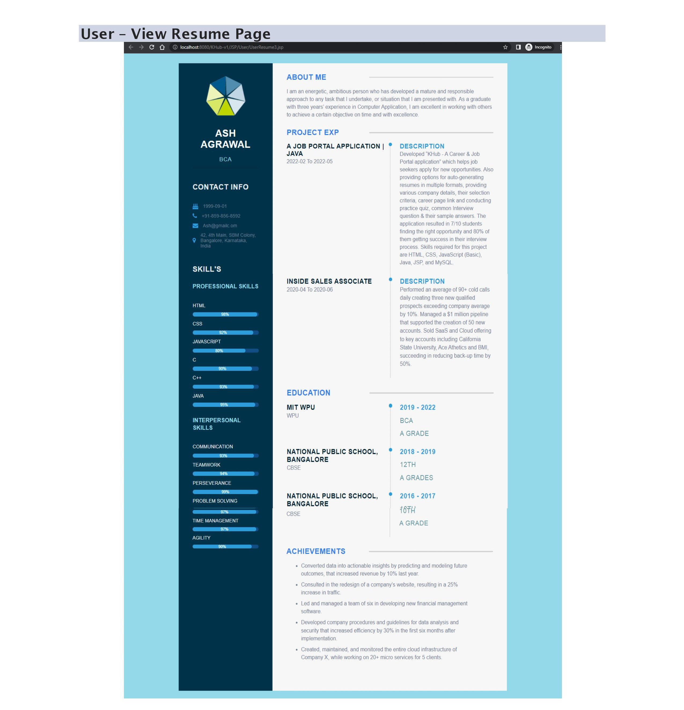
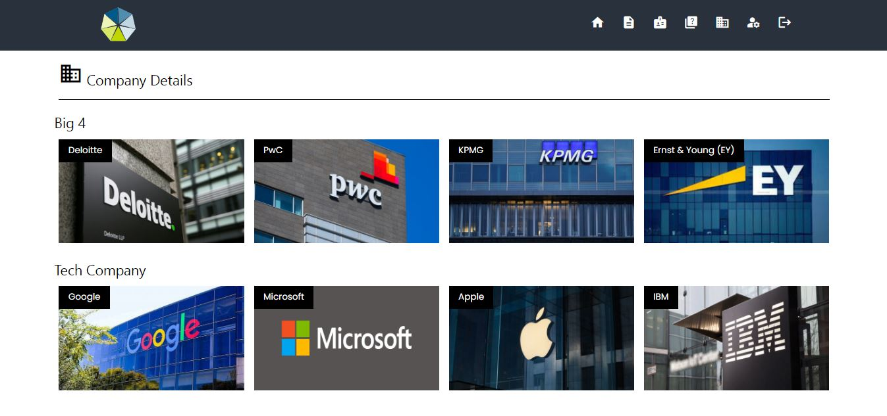
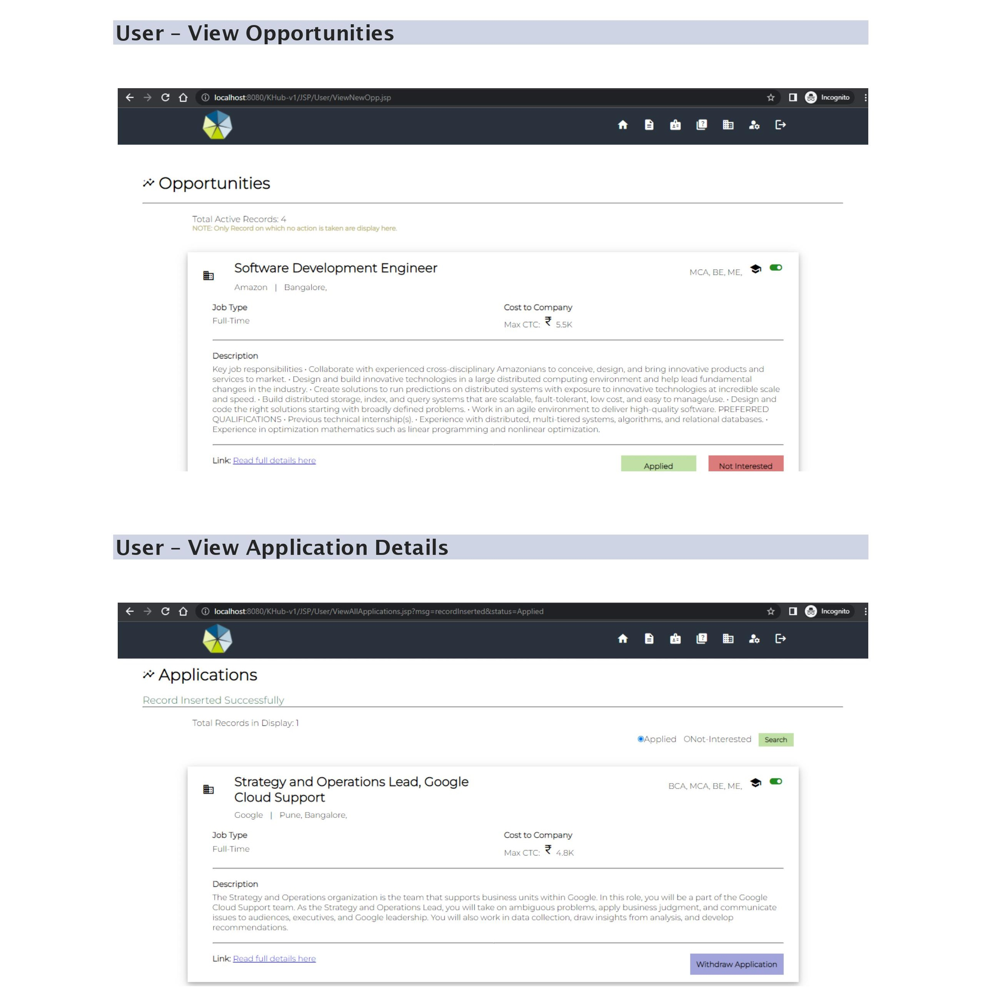
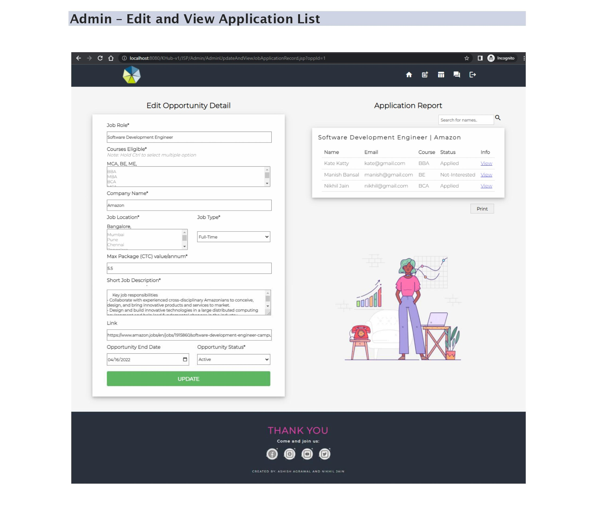

# Hi, I'm Ashish! 👋

# KHub (Java Full Stack Project)

A brief description of what this project does and who it's for...

The project KHub – A Job Portal, is a web based application. It is a platform
where user can register, add, view, edit, update, and maintain their information. User
can also see and register for publish job opportunity. Moreover user can take practice
quiz, prepare for Interview FAQ, and see various company details. The system is
developed using Java, JSP, HTML and CSS and uses MySQL for database management.

The database can be access by Administrator. Administrator has the feature to
publish opportunity and generate report related to the publish opportunity.
Administrator also has rights to view user personal and academic details as a whole
resume. The system provides the facility to search for the records and display the list of
candidate as well as allow printing necessary records.

## Tech Stack

**Front-end:** HTML5, CSS3, JavaScript

**Server:** JSP

**Back-end:** MySQL

## 	:camera: Screenshots
<!--  Syntax:  -->

## :scroll: Lessons Learned

No matter what type of project you are building or working on, the experience and the knowledge you gain from it cannot be measure.
Some of the thing that I learned while building this project is that creating a project is not a one day task and you need to be consistent.
Keep building, converting and enjoying the process as you move forward.
Aslo note that mistakes are their to happen, but you should not shy from it. Analysed your mistakes, and learned from it.

Some of main lession I learned:
- Start with a plan, Brainstorm and not just directly jump on it.
- Be a little proactive.
- If its a large projects, divide it into modules.
- Make prototype / Wireframe of your idea/module. This will prevent any future problem and save time.
- Document as you build and not postponed it to the end.

# "Build, make mistake, learned from it and build again."

## 🚀 About Me
I'm a full stack & Front-end Developer | Google UX Design Certified, I'm a curious learner who always gives ideas a wings to fly. 

You can follow me on <a href="https://www.github.com/afirestriker">GitHub</a>, <a href="https://www.linkedin.com/in/ashish-agrawal-india">Linkedin</a>, <a href="https://www.twitter.com/_afirestriker">Twitter</a>, or watch and subscibe me on <a href="https://www.youtube.com/specialdays">Youtbe/SpecialDays</a>

